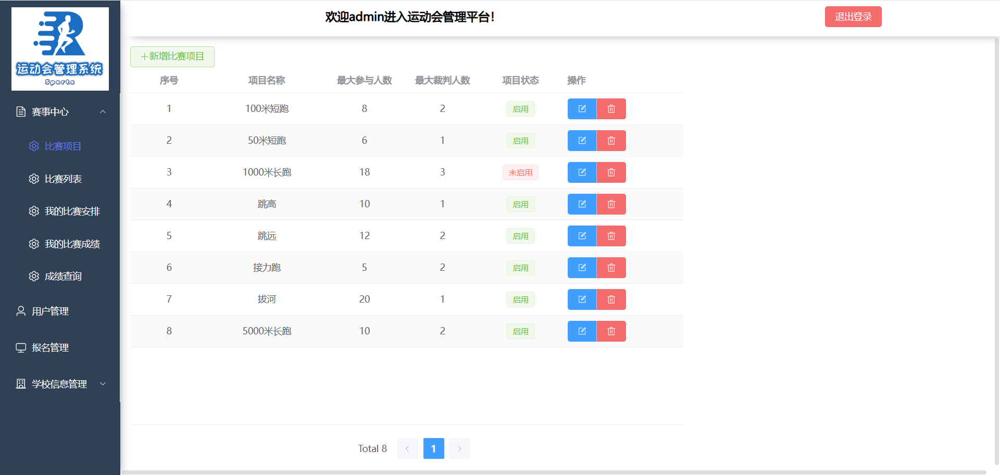
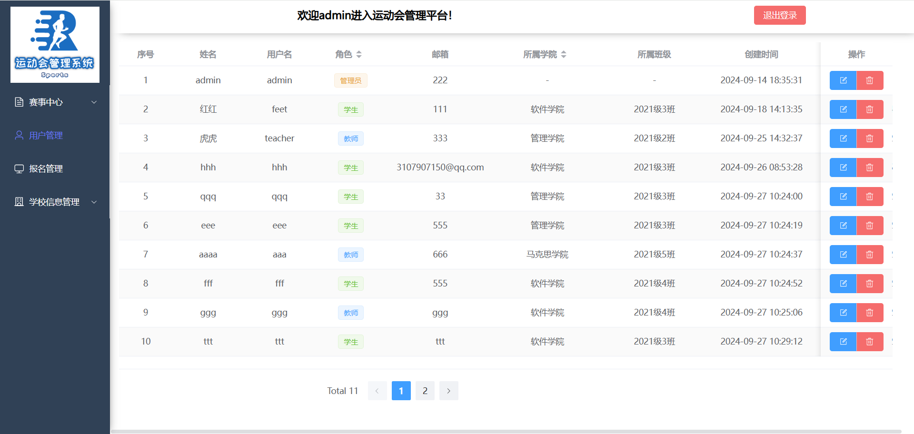
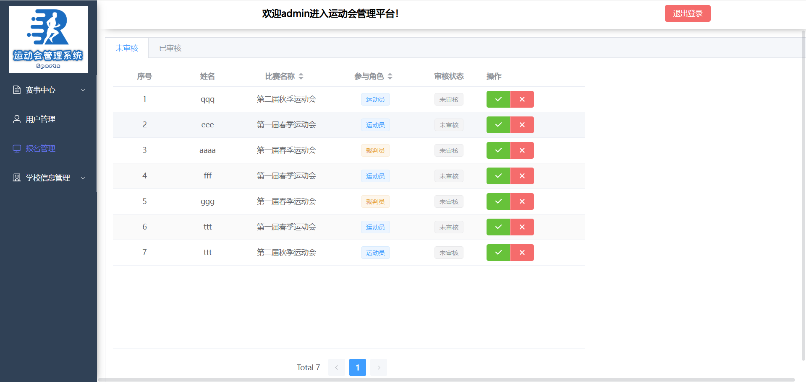
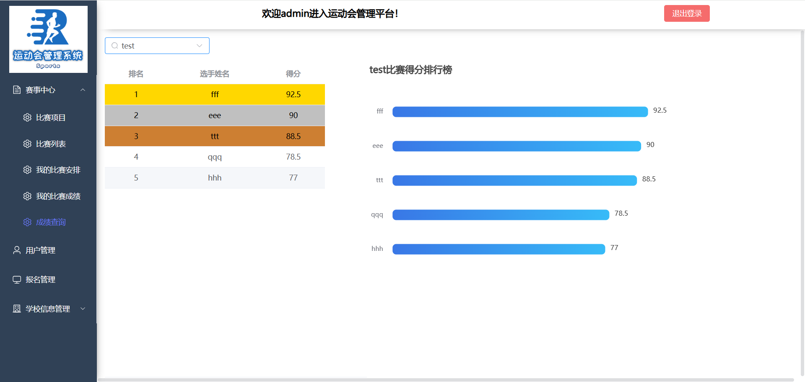

## 校园运动会管理系统

### 技术栈：
* 前端：Vue3 + Vite + element-plus + axios
* 后端：SpringBoot3 + SpringSecurity + MybatisPlus
* 数据库：Mysql(5.6+) + Redis
* JDK：Java17+

### 介绍
本项目是基于JWT令牌进行登录验证的前后端分离项目，
包括基本的用户管理，权限管理，班级/学院管理，比赛类别管理，比赛管理，成绩管理，报名管理等功能，基本完善的后台管理。

### 前端页面展示(部分)
比赛管理：

用户管理：

报名管理：

成绩查询：

* 在本地部署项目请看部署手册
* 数据库文件在包括在上传文件里
