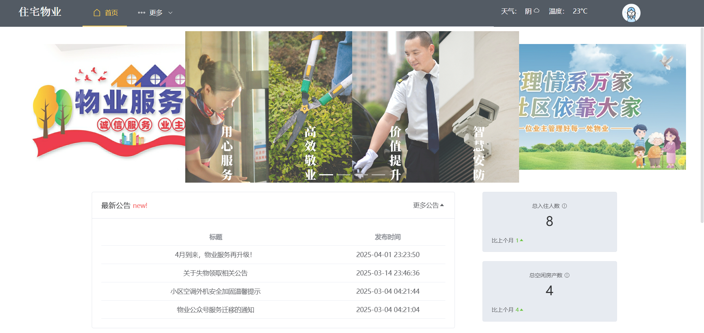
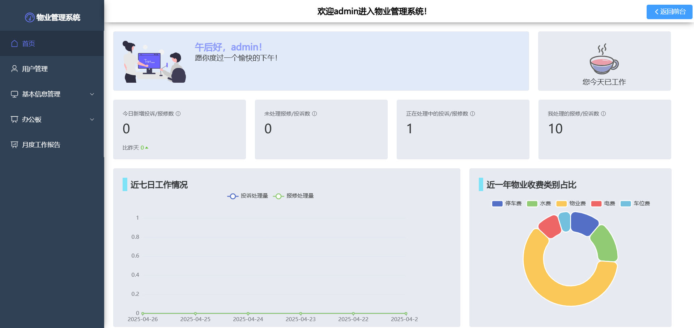

## 住宅物业管理系统

### 技术栈：

* 前端：Vue3 + Vite + element-plus + axios
* 后端：SpringBoot3 + SpringSecurity + MybatisPlus
* 数据库：Mysql(5.6+) + Redis
* JDK：Java17+

### 介绍

本项目是一个基于Vue3和Spring Boot3的前后端分离的物业管理系统，涵盖了用户认证、物业管理、实时通信、数据统计等多个功能模块。前端使用Vue3和Element
Plus构建用户界面，后端使用Spring Boot和MyBatis
Plus处理业务逻辑，并通过JWT进行身份验证。项目还集成了Swagger进行API文档管理，使用WebSocket实现实时通信，支持与DeepSeek进行对话。

### 核心功能：

* 用户认证：用户可以注册、登录和修改密码。
* 用户管理：物业人员可以管理用户信息，包括添加、修改、删除和封禁用户，可通过导入Excel文件批量导入用户信息。
* 房产管理：物业人员可以管理房产信息，包括添加、修改和删除房产，支持通过Excel文件批量导入房产信息。
* 公告管理：物业人员和管理员可以管理公告。
* 投诉管理、报修管理：物业人员和管理员可以处理业主申请的投诉和维修，维修会产生报修费用。
* 在线缴费：由物业人员发布缴费账单，业主可以进行在线缴费。
* 月度报表：系统每月生成月度报表，方便管理人员统计和分析数据。
* 日志记录：系统记录了所有用户操作的日志，便于系统问题排查。
* 聊天机器人：用户可以与聊天机器人进行对话。
* 社区聊天室：用户可以进入聊天室进行实时交流。

### 项目结构：

* frontend：前端项目，使用Vue3和Element Plus构建。
* backend：后端项目，使用Spring Boot和MyBatis Plus构建。
* docs：项目文档，包括API文档、部署手册等。

### 项目运行效果：
* 前台：
  

* 后台：

[//]: # (### 如何贡献：)

[//]: # (* 欢迎大家 fork 项目并提交 PR，一起完善这个项目。)

[//]: # (* 如果有更好的建议，欢迎提 issue。)

[//]: # (* 联系开发者：电子邮箱 3107907150@qq.com)

### 如何使用：
* 在本地部署项目请看部署手册
* 数据库文件包括在上传文件里
