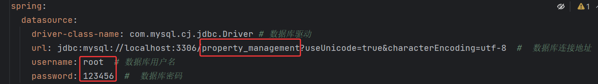
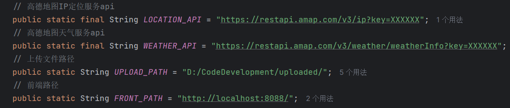

# 部署手册

### 数据库
* 将doc文件夹中的数据库sql文件在数据库管理工具中运行
* 在后端配置正确的MySQL数据源(配置文件为[application-dev.yml](..%2Fdemo-backend%2Fsrc%2Fmain%2Fresources%2Fapplication-dev.yml))：

红框指示的地方是需要更改的地方
* Redis数据库配置为默认，如果自行修改过请保证配置一致

### 后端
* 下载后端依赖[pom.xml](..%2Fdemo-backend%2Fpom.xml)(注意：项目设置的JDK要17+，Maven配置路径需正确)
* 配置后端邮箱服务(配置文件为[application.yml](..%2Fdemo-backend%2Fsrc%2Fmain%2Fresources%2Fapplication.yml)):
"XX"需根据注解自行填充
* 配置AI对话服务:[DeepSeekUtil.java](..%2Fdemo-backend%2Fsrc%2Fmain%2Fjava%2Fcom%2Fexample%2Futil%2FDeepSeekUtil.java)
  (根据注解自行配置Api Key和Model)
* 配置常量(需要配置如下内容):[Const.java](..%2Fdemo-backend%2Fsrc%2Fmain%2Fjava%2Fcom%2Fexample%2Futil%2Fconsts%2FConst.java)

### 前端
* 下载前端依赖[README.md](..%2Fdemo-frontend%2FREADME.md)，依次运行前两个sh命令(前提：已安装node)

### 运行
* 运行后端项目，本地MySQL服务，Redis服务
* 运行前端项目，浏览器访问：http://localhost:8080
